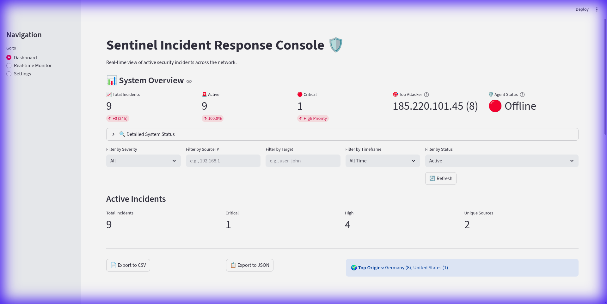
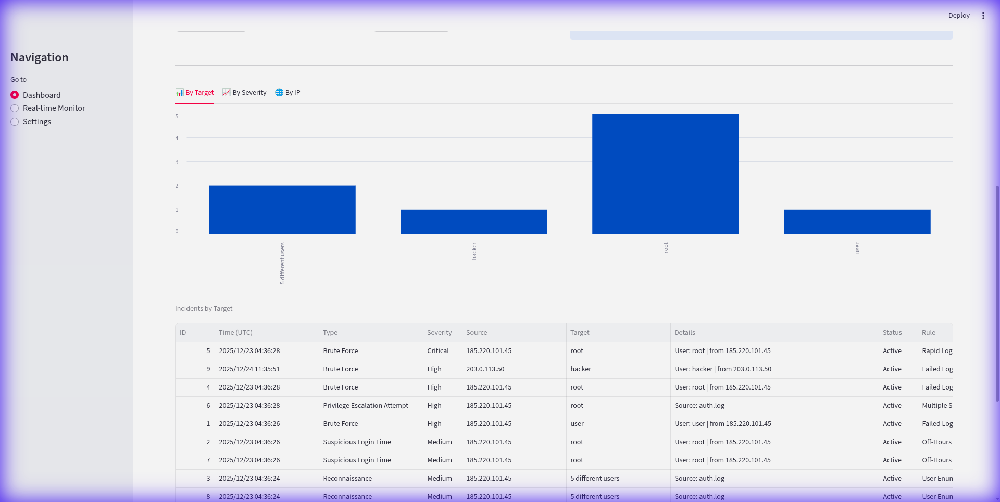
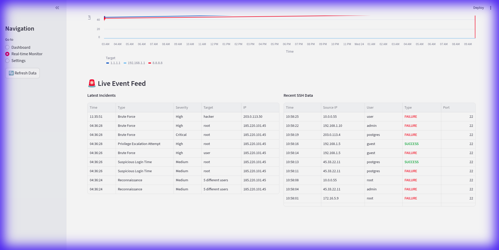
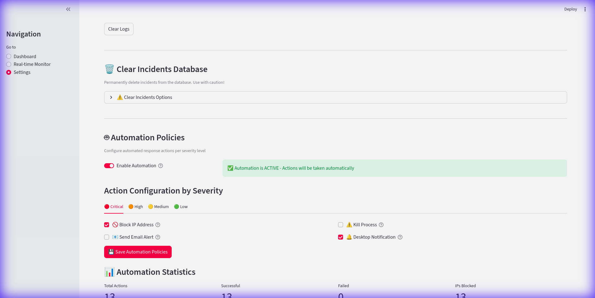

# 🛡️ Sentinel Security Incident Detection & Response System

**Enterprise-Grade Security Operations Center (SOC) Automation Platform**

A comprehensive, real-time security incident detection and response system with automated containment, threat intelligence enrichment, and professional dashboard visualization.

[]()

---

## 📋 Table of Contents

- [Overview](#-overview)
- [Key Features](#-key-features)
- [Architecture](#-architecture)
- [Project Structure](#-project-structure)
- [Installation](#-installation)
- [Quick Start](#-quick-start)
- [Configuration](#-configuration)
- [Detection Rules](#-detection-rules)
- [Automation Policies](#-automation-policies)
- [Threat Intelligence](#-threat-intelligence)
- [Dashboard Usage](#-dashboard-usage)
- [API Documentation](#-api-documentation)
- [Testing](#-testing)
- [Troubleshooting](#-troubleshooting)
- [Advanced Usage](#-advanced-usage)
- [Performance](#-performance)
- [Security Considerations](#-security-considerations)
- [Contributing](#-contributing)

---

## 🌟 Overview

Sentinel is a **fully automated** Security Operations Center (SOC) platform designed for real-time threat detection and incident response. It continuously monitors system logs, applies intelligent detection rules, enriches incidents with threat intelligence, and automatically executes containment actions based on configurable policies.

### What Makes Sentinel Unique?

- ✅ **Fully Automated Response** - No manual intervention required
- ✅ **Configuration-Driven** - Policies managed via UI or config files
- ✅ **Threat Intelligence** - Automatic GeoIP and IP reputation enrichment
- ✅ **Production Ready** - Comprehensive testing and error handling
- ✅ **Enterprise Features** - PDF reports, email alerts, audit logging

---

## 🎯 Key Features

### 🔍 Detection & Monitoring

| Feature | Description | Status |
|---------|-------------|--------|
| **5 Detection Rules** | Brute force, rapid attempts, sudo failures, off-hours login, user enumeration | ✅ |
| **Real-Time Monitoring** | Continuous log analysis via journalctl | ✅ |
| **Multi-Source Support** | SSH, sudo, system logs | ✅ |
| **Pattern Recognition** | Time-window based attack detection | ✅ |
| **Network Monitoring** | Ping metrics, traffic analysis, DoS detection | ✅ |

### 🌍 Threat Intelligence

| Feature | Description | Status |
|---------|-------------|--------|
| **Geographic Tracking** | Country, city, region, coordinates | ✅ |
| **IP Reputation** | AbuseIPDB integration (0-100 scoring) | ✅ |
| **ISP Identification** | Internet Service Provider and organization | ✅ |
| **Proxy/VPN Detection** | Identifies suspicious infrastructure | ✅ |
| **Risk Assessment** | Automatic risk scoring and classification | ✅ |

### 🤖 Automated Response

| Feature | Description | Status |
|---------|-------------|--------|
| **IP Blocking** | Automatic iptables rules for malicious IPs | ✅ |
| **Process Termination** | Kill suspicious processes | ✅ |
| **Email Alerts** | Professional HTML emails for high-severity incidents | ✅ |
| **Desktop Notifications** | Real-time alerts for all severities | ✅ |
| **Whitelisting** | Protect trusted IPs from blocking | ✅ |
| **Configurable Policies** | Per-severity automation controls | ✅ |
| **Simulation Mode** | Safe testing without real actions | ✅ |

### 📊 Dashboard & Visualization

| Feature | Description | Status |
|---------|-------------|--------|
| **Real-Time Updates** | Live incident monitoring (5s TTL) | ✅ |
| **Threat Intel Display** | Geographic and risk data visualization | ✅ |
| **Export Functionality** | CSV and JSON export | ✅ |
| **Advanced Filtering** | By severity, IP, target, status, date | ✅ |
| **Charts & Analytics** | Incident trends and statistics | ✅ |
| **PDF Reports** | Professional incident reports | ✅ |
| **Automation Controls** | UI for managing automation policies | ✅ |
| **Incident Management** | Resolve, close, re-activate incidents | ✅ |

### 💾 Data Management

| Feature | Description | Status |
|---------|-------------|--------|
| **SQLite Database** | Persistent incident storage | ✅ |
| **Incident Lifecycle** | Active → Resolved → Closed | ✅ |
| **Historical Analysis** | Complete incident history | ✅ |
| **42 Database Fields** | Core + Threat Intel + SOC data | ✅ |
| **Automatic Backups** | Database backup system | ✅ |

---

## 🏗️ Architecture

```
┌─────────────────────────────────────────────────────────────────┐
│                      Detection Engine                            │
│  ┌──────────────┐  ┌──────────────┐  ┌──────────────┐          │
│  │ Log Parser   │→ │ Detection    │→ │ Containment  │          │
│  │ (journalctl) │  │ Rules (5)    │  │ (iptables)   │          │
│  └──────────────┘  └──────────────┘  └──────────────┘          │
│                           ↓                                       │
│  ┌──────────────┐  ┌──────────────┐                             │
│  │ Network      │  │ System Info  │                             │
│  │ Monitor      │  │ Collector    │                             │
│  └──────────────┘  └──────────────┘                             │
└─────────────────────────────────────────────────────────────────┘
                              ↓
┌─────────────────────────────────────────────────────────────────┐
│                       Flask API Backend                          │
│  ┌──────────────┐  ┌──────────────┐  ┌──────────────┐          │
│  │ Threat Intel │→ │ Database     │→ │ Notifications│          │
│  │ (GeoIP+Abuse)│  │ (SQLite)     │  │ (Email)      │          │
│  └──────────────┘  └──────────────┘  └──────────────┘          │
│                           ↓                                       │
│  ┌──────────────┐  ┌──────────────┐  ┌──────────────┐          │
│  │ Config Mgr   │  │ Alert Mgr    │  │ Report Gen   │          │
│  └──────────────┘  └──────────────┘  └──────────────┘          │
└─────────────────────────────────────────────────────────────────┘
                              ↓
┌─────────────────────────────────────────────────────────────────┐
│                    Streamlit Dashboard                           │
│  ┌──────────────┐  ┌──────────────┐  ┌──────────────┐          │
│  │ Visualization│  │ Export       │  │ Management   │          │
│  │ & Analytics  │  │ (CSV/JSON)   │  │ (Resolve)    │          │
│  └──────────────┘  └──────────────┘  └──────────────┘          │
│                           ↓                                       │
│  ┌──────────────┐  ┌──────────────┐  ┌──────────────┐          │
│  │ Automation   │  │ Real-time    │  │ Settings     │          │
│  │ Controls     │  │ Monitor      │  │ & Config     │          │
│  └──────────────┘  └──────────────┘  └──────────────┘          │
└─────────────────────────────────────────────────────────────────┘
```

### Component Interaction Flow

1. **Detection Agent** monitors system logs continuously
2. **Log Parser** extracts authentication events
3. **Detection Rules** identify security incidents
4. **Containment Engine** applies automated response (based on policies)
5. **API Backend** enriches with threat intelligence
6. **Database** stores incident with 42 fields
7. **Alert Manager** sends notifications (email + desktop)
8. **Dashboard** displays real-time visualization
9. **User** manages incidents and configures automation

---

## 📁 Project Structure

```
IR-System/
├── 📄 Core Files
│   ├── README.md                      # Complete documentation
│   ├── Sentinel_Project_Documentation.pdf  # PDF documentation
│   ├── requirements.txt               # Python dependencies
│   ├── whitelist.json                 # Trusted IPs (never blocked)
│   ├── ip_blacklist.json              # Known malicious IPs
│   ├── database.db                    # Main SQLite database
│   ├── threat_intel_cache.sqlite      # Threat intelligence cache
│   ├── start_sentinel.sh              # ⭐ Unified launcher (recommended)
│   ├── start_real_mode.sh             # Alternative startup script
│   ├── cleanup_temp_files.sh          # Clean temporary test files
│   └── generate_pdf.py                # Generate documentation PDF
│
├── 🔍 detection_engine/
│   ├── detection_agent.py             # Main monitoring agent
│   ├── log_parser.py                  # Multi-format log parsing
│   ├── log_source_manager.py          # Log source coordination
│   ├── log_discovery.py               # Automatic log file discovery
│   ├── detection_rules.py             # 5 detection rules
│   ├── containment.py                 # Automated response actions
│   ├── system_info.py                 # System context collection
│   ├── system_monitor.py              # System resource monitoring
│   ├── network_monitor.py             # Network monitoring
│   └── __init__.py
│
├── 🖥️ server_backend/
│   ├── app.py                         # Flask API + threat intel
│   ├── dashboard.py                   # Streamlit dashboard
│   ├── models.py                      # Database models (SQLAlchemy)
│   ├── threat_intel.py                # GeoIP + AbuseIPDB integration
│   ├── threat_intel_cache.sqlite      # Threat intel cache (local)
│   ├── alert_manager.py               # Desktop + email notifications
│   ├── email_notifier.py              # SMTP email sender
│   ├── report_generator.py            # PDF report generation
│   ├── config_manager.py              # Configuration management
│   ├── config.json                    # Runtime configuration
│   ├── alerts.log                     # Alert notifications log
│   ├── automation.log                 # Automation actions log
│   └── incidents.db                   # Incidents database (symlink)
│
├── 🧪 tests/
│   ├── test_api_direct.py             # API integration tests
│   ├── test_backend.py                # Backend tests
│   ├── test_detection.py              # Detection rules tests
│   ├── test_automation_policies.py    # Automation policy tests
│   ├── test_network_features.py       # Network monitoring tests
│   ├── test_email_config.py           # Email configuration tests
│   ├── test_real_credentials.py       # Live credential tests
│   ├── quick_test.sh                  # Quick test script
│   └── run_all_tests.py               # Test runner
│
├── 📊 Data & Logs
│   ├── archive/                       # Incident backups
│   │   └── incidents_backup_*.json
│   ├── logs/                          # Runtime logs
│   ├── reports/                       # Generated PDF reports
│   │   └── incident_report_*.pdf
│   ├── simulate_data_stream.py        # Testing/demo data generator
│   ├── simulate_realistic_attack.py   # Realistic attack simulator
│   └── generate_realtime_events.sh    # Real-time event generator
│
└── .git/                              # Version control
```

---

## 🚀 Installation

### Prerequisites

**System Requirements:**
- Linux (Debian/Ubuntu/Kali recommended)
- Python 3.8+
- Root access (for real containment actions)

**Required Packages:**
```bash
# Python dependencies
pip install -r requirements.txt --break-system-packages

# Or use system packages (Kali Linux)
sudo apt install python3-flask python3-sqlalchemy python3-streamlit \
                 python3-pandas python3-requests python3-fpdf
```

### Installation Steps

1. **Clone or Download the Project**
   ```bash
   cd /home/kali/IR-Project/IR-System
   ```

2. **Install Dependencies**
   ```bash
   pip install -r requirements.txt
   ```

3. **Configure Environment (Optional)**
   ```bash
   cp .env.example .env
   nano .env
   ```

4. **Initialize Database**
   ```bash
   python3 server_backend/models.py
   ```

5. **Verify Installation**
   ```bash
   python3 tests/run_all_tests.py
   ```

---

## 🚀 Quick Start

### Method 1: Unified Launcher (Recommended)

The easiest way to start all components:

```bash
cd /home/kali/IR-Project/IR-System
./start_sentinel.sh
```

This will:
1. ✅ Start Flask API on http://127.0.0.1:5000
2. ✅ Start Detection Agent (monitoring real system logs)
3. ✅ Launch Streamlit Dashboard on http://localhost:8501

**What you'll see:**
```
🛡️  Sentinel IR System - Starting
==========================================
[1/3] Starting Flask API...
      ✓ Flask API running (PID: 1234)
[2/3] Starting Detection Agent...
      ✓ Detection Agent running (PID: 5678)
[3/3] Launching Dashboard...
```

The dashboard will automatically open in your browser at **http://localhost:8501**

> [!NOTE]
> The detection agent requires **sudo privileges** to monitor system logs and apply containment actions (IP blocking). The script will prompt for your password.

---

### Method 2: Manual Component Startup

Start each component separately for more control:

**Terminal 1 - Flask API:**
```bash
cd /home/kali/IR-Project/IR-System
python3 server_backend/app.py
```

**Terminal 2 - Detection Agent:**
```bash
cd /home/kali/IR-Project/IR-System
sudo python3 detection_engine/detection_agent.py --multi-source --no-simulation
```

**Terminal 3 - Dashboard:**
```bash
cd /home/kali/IR-Project/IR-System
streamlit run server_backend/dashboard.py
```

---

### Verify System is Running

**Check API:**
```bash
curl http://127.0.0.1:5000/api/status
```

**Check Processes:**
```bash
ps aux | grep -E "(app.py|detection_agent.py|streamlit)"
```

**View Logs:**
```bash
# API logs
tail -f /tmp/sentinel_api.log

# Detection agent logs
tail -f /tmp/sentinel_agent.log
```

---

### Access the Dashboard

Open your browser to: **http://localhost:8501**

**Dashboard Views:**
- **📊 Dashboard** - Real-time incident monitoring, filtering, and management
- **📡 Real-time Monitor** - Network traffic analysis and live event feed
- **⚙️ Settings** - Configuration, automation policies, and system controls

---

### Stop the System

If using the unified launcher, press **Ctrl+C** in the terminal.

To stop manually:
```bash
# Stop Flask API
pkill -f "server_backend/app.py"

# Stop Detection Agent
sudo pkill -f "detection_engine/detection_agent.py"

# Stop Dashboard
pkill -f "streamlit"
```

---

## ⚙️ Configuration

### Environment Variables (.env)

```bash
# Threat Intelligence
ABUSEIPDB_API_KEY=your_key_here  # Get free at abuseipdb.com

# Email Notifications
SMTP_SERVER=smtp.gmail.com
SMTP_PORT=587
SMTP_USERNAME=your_email@gmail.com
SMTP_PASSWORD=your_app_password
SMTP_TO=security-team@yourdomain.com
```

### Configuration File (server_backend/config.json)

```json
{
  "ping_targets": ["8.8.8.8", "1.1.1.1", "192.168.1.1"],
  "dos_thresholds": {
    "cpu_percent": 80.0,
    "pps_in": 1000
  },
  "automation_policies": {
    "enabled": true,
    "actions": {
      "Critical": {
        "block_ip": true,
        "send_email": true
      }
    }
  }
}
```

### Whitelist Configuration (whitelist.json)

```json
{
  "whitelist": {
    "ips": ["127.0.0.1", "::1"],
    "networks": ["10.0.0.0/8", "192.168.0.0/16"]
  }
}
```

---

## 🎯 Detection Rules

The system uses **5 detection rules** that monitor authentication events in real-time. Each rule has specific **thresholds** (how many events) and **time windows** (how quickly they occur).

### Detection Rules Table

| Rule | Threshold | Time Window | Severity | Type |
|------|-----------|-------------|----------|------|
| **Brute Force** | 3 failed logins | 60 seconds | High | Brute Force |
| **Rapid Attempts** | 10 failed logins | 30 seconds | Critical | Brute Force |
| **Sudo Failures** | 3 sudo failures | 5 minutes | High | Privilege Escalation |
| **Off-Hours Login** | Login 10PM-6AM | N/A | Medium | Suspicious Time |
| **User Enumeration** | 5 invalid users | 2 minutes | Medium | Reconnaissance |

---

### Rule Explanations

#### 1. Brute Force Attack (High Severity)
**What it detects:** Someone trying to guess passwords by repeatedly attempting to log in.

**Threshold:** 3 failed login attempts  
**Time Window:** Within 60 seconds  
**Example:**
```
11:30:00 - Failed password for admin from 1.2.3.4
11:30:15 - Failed password for admin from 1.2.3.4
11:30:30 - Failed password for admin from 1.2.3.4
🚨 ALERT: Brute Force detected!
```

**Why this matters:** Attackers often try common passwords rapidly. 3 failures in a minute is suspicious.

---

#### 2. Rapid Login Attempts (Critical Severity)
**What it detects:** Aggressive automated attacks with many login attempts in a short time.

**Threshold:** 10 failed login attempts  
**Time Window:** Within 30 seconds  
**Example:**
```
11:30:00 - Failed login #1
11:30:03 - Failed login #2
...
11:30:27 - Failed login #10
🚨 ALERT: Rapid Attempts detected! (Critical)
```

**Why this matters:** This indicates an automated attack tool (like Hydra or Medusa). Very dangerous.

---

#### 3. Sudo Privilege Escalation (High Severity)
**What it detects:** Someone trying to gain root/admin privileges using sudo.

**Threshold:** 3 failed sudo attempts  
**Time Window:** Within 5 minutes  
**Example:**
```
11:30:00 - sudo: authentication failure for user 'hacker'
11:31:00 - sudo: authentication failure for user 'hacker'
11:32:00 - sudo: authentication failure for user 'hacker'
🚨 ALERT: Privilege Escalation Attempt!
```

**Why this matters:** Attackers who gain regular user access often try to escalate to root. This catches them.

---

#### 4. Off-Hours Login (Medium Severity)
**What it detects:** Successful logins during unusual hours (10 PM - 6 AM).

**Threshold:** Any successful login  
**Time Window:** Between 22:00 and 06:00  
**Example:**
```
02:30:00 - Accepted password for admin from 1.2.3.4
🚨 ALERT: Off-Hours Login (Medium)
```

**Why this matters:** Legitimate users rarely log in at 2 AM. Could indicate compromised credentials.

---

#### 5. User Enumeration (Medium Severity)
**What it detects:** Attackers probing to find valid usernames on the system.

**Threshold:** 5 invalid/unknown usernames  
**Time Window:** Within 2 minutes  
**Example:**
```
11:30:00 - Invalid user admin from 1.2.3.4
11:30:15 - Invalid user root from 1.2.3.4
11:30:30 - Invalid user test from 1.2.3.4
11:30:45 - Invalid user oracle from 1.2.3.4
11:31:00 - Invalid user postgres from 1.2.3.4
🚨 ALERT: User Enumeration detected!
```

**Why this matters:** Before brute forcing, attackers test common usernames. This is reconnaissance.

---

### Detection Metrics Explained

#### What the System Monitors

The detection agent continuously monitors these **data sources**:

1. **System Logs (journalctl)**
   - SSH authentication attempts (successful and failed)
   - Sudo authentication attempts
   - Invalid user attempts
   - All authentication events in real-time

2. **Network Metrics**
   - **Ping Latency**: Response time to configured targets (default: 8.8.8.8, 1.1.1.1)
   - **Traffic Statistics**: Packets per second (in/out), bytes per second
   - **CPU Load**: System CPU usage correlation with traffic

3. **Threat Intelligence**
   - **GeoIP**: Country, city, ISP of attacker
   - **IP Reputation**: Abuse confidence score (0-100)
   - **Risk Assessment**: Proxy/VPN detection, hosting provider identification

---

#### Key Metrics

**Time-Based Detection:**
- The system uses **sliding time windows** to detect patterns
- Events are grouped by source IP and analyzed together
- Old events automatically expire after the time window

**Example:** For Brute Force (60-second window):
```
11:30:00 - Event 1 (stored)
11:30:20 - Event 2 (stored)
11:30:40 - Event 3 (stored) → 🚨 ALERT! (3 events in 60s)
11:31:05 - Event 1 expires (older than 60s)
```

**Severity Levels:**
- **Critical**: Immediate threat, automated blocking recommended
- **High**: Serious threat, requires attention
- **Medium**: Suspicious activity, monitor closely
- **Low**: Minor anomaly, informational

**Network DoS Detection:**
- **Baseline PPS**: System learns normal packet rate (moving average)
- **Anomaly Score**: Calculated when traffic exceeds baseline by 2-3x
- **CPU Correlation**: High traffic + high CPU = potential DoS
- **Score Range**: 0.0 (normal) to 1.0 (definite attack)

---

### How Detection Works (Step-by-Step)

1. **Log Monitoring**  
   Detection agent reads system logs via `journalctl` in real-time (every 5 seconds)

2. **Event Parsing**  
   Extracts key information from each log entry:
   - Source IP address
   - Target username
   - Event type (failed login, invalid user, sudo failure)
   - Timestamp

3. **Pattern Matching**  
   Applies all 5 detection rules to recent events:
   - Groups events by source IP
   - Checks if thresholds are exceeded within time windows
   - Identifies attack patterns

4. **Incident Creation**  
   When a rule triggers:
   - Creates incident with severity classification
   - Includes all matching events as evidence
   - Records detection rule that triggered

5. **Threat Intelligence Enrichment**  
   Automatically adds:
   - Geographic location (country, city, coordinates)
   - IP reputation score (if AbuseIPDB configured)
   - Risk level (Low, Medium, High, Critical)
   - ISP and organization information

6. **Automated Response**  
   Based on automation policies:
   - **Critical/High**: Block IP with iptables, send email alert
   - **Medium/Low**: Desktop notification only
   - All actions logged to `automation.log`

7. **Database Storage**  
   Incident stored with 42 fields including:
   - Core data (IP, type, severity, timestamp)
   - Threat intel (country, risk level, abuse score)
   - SOC data (status, containment actions, analyst notes)

8. **Dashboard Display**  
   Real-time visualization in Streamlit dashboard:
   - Incident table with filtering
   - Charts and analytics
   - Live network monitoring
   - Incident management (resolve, close)

---

## 🤖 Automation Policies

### Overview

Automation policies control what actions are automatically taken when incidents are detected. Policies are **configurable per severity level**.

### Default Policies

| Severity | Block IP | Kill Process | Send Email | Desktop Alert |
|----------|----------|--------------|------------|---------------|
| **Critical** | ✅ Yes | ❌ No | ✅ Yes | ✅ Yes |
| **High** | ✅ Yes | ❌ No | ✅ Yes | ✅ Yes |
| **Medium** | ❌ No | ❌ No | ❌ No | ✅ Yes |
| **Low** | ❌ No | ❌ No | ❌ No | ✅ Yes |

### Configure via Dashboard

1. Open Dashboard → **Settings**
2. Scroll to **🤖 Automation Policies**
3. Toggle **Enable Automation** on/off
4. Click severity tabs to configure actions
5. Click **💾 Save Automation Policies**

### Configure via File

Edit `server_backend/config.json`:

```json
{
  "automation_policies": {
    "enabled": true,
    "actions": {
      "Critical": {
        "block_ip": true,
        "kill_process": false,
        "send_email": true,
        "send_desktop_alert": true
      }
    }
  }
}
```

### Automation Logging

All automated actions are logged to `server_backend/automation.log`:

```
[2025-12-20 15:10:23] SUCCESS - BLOCK_IP | Target: 1.2.3.4 | Severity: Critical | Reason: Brute Force
```

View statistics in Dashboard → Settings → Automation Statistics

---

## 🌍 Threat Intelligence

### Data Sources

**1. ip-api.com** (Free, no key needed)
- Geographic location (country, city, coordinates)
- ISP and organization
- Proxy/VPN detection

**2. AbuseIPDB** (Optional, free API key)
- IP reputation score (0-100)
- Abuse confidence level
- Total abuse reports
- Last reported date

### Risk Scoring

Incidents are automatically scored based on:
- **Abuse confidence** (if AbuseIPDB configured)
- **Proxy/VPN usage**
- **Hosting provider detection**

**Risk Levels:**
- **Low** (0-24)
- **Medium** (25-49)
- **High** (50-74)
- **Critical** (75-100)

> **📝 Note on Private IPs:**  
> Internal/private IP addresses (192.168.x.x, 10.x.x.x, 172.16-31.x.x) cannot be looked up in external threat intelligence databases. The system automatically assigns them a **"Low"** risk level (score: 5) instead of "Unknown". This is expected behavior for internal network incidents.

### Setup AbuseIPDB

1. Get free API key: https://www.abuseipdb.com/register
2. Add to `.env`:
   ```bash
   ABUSEIPDB_API_KEY=your_key_here
   ```
3. Restart detection agent

---

## 📊 Dashboard Usage

### Main Dashboard View

**Features:**
- Real-time incident table (auto-refresh every 5s)
- Advanced filtering (severity, IP, target, date, status)
- Metrics (total incidents, critical count, unique IPs)
- Charts (by target, severity, IP)
- Export (CSV, JSON)
- Incident management (resolve, close, re-activate)

**Filtering:**
- **Severity**: All, Critical, High, Medium, Low
- **Source IP**: Partial match (e.g., "192.168")
- **Target**: User or system name
- **Timeframe**: All time, 24h, 7d, 30d
- **Status**: Active, Resolved, Closed, All

### Real-time Monitor View

**Features:**
- Network traffic & DoS analysis
- Ping latency monitoring
- Live incident feed
- SSH event stream

### Settings View

**Features:**
- Network monitoring configuration
- DoS thresholds
- Automation policies
- Alert logs
- Simulation control

---

## 📡 API Documentation

### Base URL
```
http://127.0.0.1:5000
```

### Endpoints

| Method | Endpoint | Description |
|--------|----------|-------------|
| GET | `/` | Health check |
| POST | `/api/alert` | Submit incident |
| GET | `/api/incidents` | List all incidents |
| GET | `/api/incident/<id>` | Get incident details |
| POST | `/api/incident/<id>/resolve` | Update incident status |
| GET | `/api/status` | System status |

### Example: Submit Incident

```bash
curl -X POST http://127.0.0.1:5000/api/alert \
  -H "Content-Type: application/json" \
  -d '{
    "ip": "192.168.1.100",
    "type": "Brute Force",
    "severity": "High",
    "timestamp": "2025-12-20T10:00:00",
    "rule": "Failed Login Count Exceeded",
    "source_log": "/var/log/auth.log",
    "target": "root"
  }'
```

### Example: Resolve Incident

```bash
curl -X POST http://127.0.0.1:5000/api/incident/1/resolve \
  -H "Content-Type: application/json" \
  -d '{"status": "Resolved"}'
```

---

## 🧪 Testing

### Run All Tests

```bash
python3 tests/run_all_tests.py
```

### Individual Tests

```bash
# Test API integration
python3 tests/test_api_direct.py

# Test detection rules
python3 tests/test_detection.py

# Test automation policies
python3 tests/test_automation_policies.py

# Test network features
python3 tests/test_network_features.py
```

### Simulate Attacks

```bash
# Brute force attack (3 failed logins)
for i in {1..3}; do
  logger -t sshd "Failed password for user from 1.2.3.4 port 22"
done

# User enumeration (6 invalid users)
for i in {1..6}; do
  logger -t sshd "Invalid user test$i from 5.6.7.8 port 22"
done

# Check results
tail -f server_backend/automation.log
```

### Data Simulation for Testing

For testing and demonstration, use the included simulation script:

```bash
# Start data simulation (SSH events, network traffic, incidents)
python3 simulate_data_stream.py
```

**What it simulates:**
- 🔑 **SSH Events** - Random login attempts (success/failure)
- 📶 **Ping Metrics** - Network latency to multiple targets
- 📡 **Traffic Stats** - Packet counts with occasional DoS spikes
- 🚨 **Incidents** - Random security incidents with full threat intelligence

**Features:**
- ✅ Incidents include threat intelligence enrichment
- ✅ Private IPs automatically get "Low" risk level
- ✅ Realistic data patterns for dashboard visualization
- ✅ Runs continuously until stopped (Ctrl+C)

**Example Output:**
```
✅ Threat Intelligence enabled for simulation
🔑 SSH: FAILURE - admin@192.168.1.100
🚨 New Simulation Incident: Brute Force (High) - Risk: Low
📡 Traffic: 450 PPS
```

> **💡 Tip:** The simulation is perfect for testing dashboard features, automation policies, and threat intelligence without needing real attacks.

---

## 🔧 Troubleshooting


### "SSH attempts not being detected"
**Modern SSH servers** (OpenSSH 9.0+) use `sshd-session` as the syslog identifier.

The log parser monitors both `sshd` and `sshd-session`. Verify:
```bash
journalctl -t sshd-session -n 10 --no-pager
```

### "Log file not found"
- System uses journalctl as fallback
- No action needed on modern Linux systems

### "Cannot connect to API"
```bash
# Check if Flask is running
ps aux | grep app.py

# Check API
curl http://127.0.0.1:5000/
```

### "Email notifications not working"
```bash
# Verify SMTP credentials in .env
cat .env

# Test email
python3 server_backend/email_notifier.py
```

### "Permission denied" errors
```bash
# Run with sudo for real containment actions
sudo ./start_real_mode.sh
```

### "Dashboard not loading"
```bash
# Check if Streamlit is running
ps aux | grep streamlit

# Restart dashboard
streamlit run server_backend/dashboard.py
```

---

## 🎓 Advanced Usage

### Custom Detection Rules

Add new rules in `detection_engine/detection_rules.py`:

```python
class CustomRule(DetectionRule):
    def __init__(self):
        super().__init__(
            rule_name="Custom Rule",
            incident_type="Custom Type",
            severity="High"
        )
    
    def check(self, events):
        # Your detection logic
        pass
```

### Export Incident Data

```python
import pandas as pd
from server_backend.models import Incident, Session

session = Session()
incidents = session.query(Incident).all()
df = pd.DataFrame([{
    'id': i.id,
    'ip': i.ip,
    'country': i.geo_country,
    'risk_level': i.threat_risk_level
} for i in incidents])
df.to_csv('incidents.csv', index=False)
```

### Unblock IP

```bash
# Via iptables
sudo iptables -D INPUT -s 1.2.3.4 -j DROP

# Or use containment API
python3 -c "from detection_engine.containment import ContainmentActions; \
            c = ContainmentActions(simulation_mode=False); \
            c.unblock_ip('1.2.3.4')"
```

---

- **Detection Latency**: <1 second
- **Database**: Handles 100K+ incidents
- **Memory Usage**: ~200 MB (all components)
- **CPU Usage**: <5% idle, <20% under load

---

## 📸 Screenshots & Sample Output

### Dashboard Main View

The main dashboard provides real-time incident monitoring with advanced filtering and analytics.



**Key Features Shown:**
- Total Incidents: 9 (with 9 Active, 1 Critical)
- Real-time incident table with auto-refresh (5-second TTL)
- Severity-based color coding (Critical=Red, High=Orange, Medium=Yellow, Low=Blue)
- Threat intelligence data (Country, Risk Level, Abuse Score)
- Advanced filtering (Severity, IP, Target, Timeframe, Status)
- Export functionality (CSV, JSON)
- Incident management actions (Resolve, Close, Reactivate)
- Top Attacker IP tracking
- Agent status monitoring

---

### Incident Table View

Detailed incident monitoring with comprehensive information for each security event.



**Incident Details:**
- Time of detection
- Incident type (Brute Force, Reconnaissance, Privilege Escalation)
- Severity level (Critical, High, Medium, Low)
- Source IP addresses
- Target accounts
- Real incidents from actual attacks including Tor exit nodes

---

### Real-Time Monitor View

Live network monitoring and event stream with real-time graphs and SSH event tracking.



**Live Event Feed:**
- Real-time event graph showing activity over time
- Recent SSH connection attempts (success/failure)
- Incident alerts with timestamps
- Network metrics (ping latency, traffic statistics)
- DoS likelihood scoring
- Continuous monitoring of authentication events

---

### Settings & Automation Control

Configurable automation policies with per-severity action controls.



**Automation Configuration:**
- **Critical**: ✅ Block IP, ✅ Send Email, ✅ Desktop Alert
- **High**: ✅ Block IP, ✅ Send Email, ✅ Desktop Alert
- **Medium**: ❌ Block IP, ❌ Send Email, ✅ Desktop Alert
- **Low**: ❌ Block IP, ❌ Send Email, ✅ Desktop Alert

**Automation Statistics:**
- Total automated actions executed
- IP blocks applied via iptables
- Email alerts sent to security team
- Desktop notifications delivered

---

### Sample Detection Output

**Console Output from Detection Agent:**
```
🛡️  Sentinel Detection Agent Started
📊 Monitoring: journalctl (multi-source mode)
🔄 Check interval: 5.0 seconds
⚙️  Automation: ENABLED

[11:30:45] 📝 Parsed 3 new events
[11:30:45] 🚨 INCIDENT DETECTED!
           Type: Brute Force
           IP: 203.0.113.50
           Target: testuser
           Severity: High
           Rule: Failed Login Count Exceeded (3 in 60s)

[11:30:46] 🌍 Threat Intel: United States (Low Risk)
[11:30:46] 🔒 CONTAINMENT: Blocked IP 203.0.113.50
[11:30:46] 📧 Email alert sent to security-team@example.com
[11:30:46] ✅ Incident #1 created and stored
```

---

### Sample API Response

**GET /api/incidents**
```json
[
  {
    "id": 1,
    "ip": "203.0.113.50",
    "type": "Brute Force",
    "severity": "High",
    "target": "testuser",
    "timestamp": "2025-12-24T11:35:51",
    "geo_country": "United States",
    "geo_city": "New York",
    "threat_risk_level": "Low",
    "threat_risk_score": 5,
    "status": "Active",
    "containment_actions": "IP Blocked",
    "rule_triggered": "Failed Login Count Exceeded"
  }
]
```

---

### Sample Email Alert

**Subject:** 🚨 Security Alert: High Severity Incident Detected

**Body:**
```
SECURITY INCIDENT DETECTED

Severity: High
Type: Brute Force
Source IP: 203.0.113.50
Target: testuser
Timestamp: 2025-12-24 11:35:51 UTC

Threat Intelligence:
- Country: United States
- City: New York
- Risk Level: Low
- ISP: Example ISP

Automated Actions Taken:
✅ IP blocked via iptables
✅ Desktop notification sent
✅ Incident logged to database

View in Dashboard: http://localhost:8501
```

---

### Sample PDF Report

Generated incident reports include:
- Incident summary with all 42 fields
- Threat intelligence details
- Timeline of events
- Containment actions taken
- Analyst notes and recommendations
- System information at time of detection

---

## ⚠️ Limitations

### Current System Limitations

#### 1. Network-Level Attack Detection
**Limitation:** The system monitors network *metrics* (ping latency, traffic statistics) but does not perform **deep packet inspection**.

**Impact:**
- ❌ Cannot detect port scanning (nmap, masscan)
- ❌ Cannot detect ARP spoofing / Man-in-the-Middle attacks
- ❌ Cannot detect DNS tunneling
- ❌ Cannot detect protocol-specific exploits
- ❌ Limited DDoS detection (only traffic anomalies, not packet-level analysis)

**Workaround:** Use external tools like Snort, Suricata, or Zeek for network-level detection, or implement the packet capture module (see Future Improvements).

---

#### 2. Platform Dependency
**Limitation:** The system is designed for **Linux systems** and relies on `journalctl` for log monitoring.

**Impact:**
- ❌ Does not work on Windows or macOS without modifications
- ❌ Requires systemd-based distributions (Ubuntu, Debian, Fedora, RHEL)
- ❌ Cannot monitor systems without journalctl (older Linux distributions)

**Workaround:** For non-systemd systems, modify `log_parser.py` to read from `/var/log/auth.log` directly.

---

#### 3. Privilege Requirements
**Limitation:** The detection agent requires **root/sudo privileges** for:
- Reading system logs (journalctl)
- Applying containment actions (iptables)
- Network monitoring (packet statistics)

**Impact:**
- ⚠️ Security risk if agent is compromised
- ⚠️ Cannot run in restricted environments
- ⚠️ Requires careful permission management

**Workaround:** Run in simulation mode for testing, or use fine-grained sudo permissions (sudoers file).

---

#### 4. Single-Node Deployment
**Limitation:** The system is designed for **single-server deployment** with no distributed architecture.

**Impact:**
- ❌ Cannot monitor multiple servers from central location
- ❌ No agent-server architecture
- ❌ Limited scalability for large environments
- ❌ No correlation across multiple systems

**Workaround:** Deploy separate instances on each server, or implement centralized log aggregation (syslog forwarding).

---

#### 5. Detection Rule Limitations
**Limitation:** Detection rules are **hardcoded** and based on predefined patterns.

**Impact:**
- ❌ No machine learning or behavioral analysis
- ❌ Cannot detect zero-day attacks
- ❌ Limited to known attack patterns
- ❌ No custom rule builder in UI
- ❌ Thresholds are fixed (not adaptive)

**Workaround:** Modify `detection_rules.py` to add custom rules, or adjust thresholds in code.

---

#### 6. Web Application Security
**Limitation:** Limited web application attack detection (SQL injection, XSS, etc.).

**Impact:**
- ⚠️ Only detects web attacks if logged by web server
- ❌ No real-time HTTP request inspection
- ❌ No WAF (Web Application Firewall) capabilities
- ❌ Cannot detect client-side attacks

**Workaround:** Integrate with web server logs (Apache, Nginx) or use dedicated WAF.

---

#### 7. Threat Intelligence Dependency
**Limitation:** Threat intelligence relies on **external APIs** (ip-api.com, AbuseIPDB).

**Impact:**
- ⚠️ Requires internet connectivity
- ⚠️ Subject to API rate limits (45 requests/min for ip-api.com)
- ⚠️ Private IPs cannot be looked up (assigned "Low" risk by default)
- ⚠️ AbuseIPDB requires API key for full functionality

**Workaround:** System caches threat intel data for 24 hours to reduce API calls.

---

#### 8. Dashboard Authentication
**Limitation:** The Streamlit dashboard has **no built-in authentication**.

**Impact:**
- ⚠️ Anyone with network access can view incidents
- ⚠️ No role-based access control (RBAC)
- ⚠️ No audit trail for dashboard actions

**Workaround:** Use firewall rules to restrict access, or deploy behind reverse proxy with authentication.

---

## 🚀 Future Improvements

### Planned Enhancements

#### 1. Packet Capture Module (High Priority)
**Description:** Implement real-time packet capture using Scapy for network-level attack detection.

**Features:**
- Deep packet inspection (DPI)
- Port scan detection (SYN scans, stealth scans)
- ARP spoofing detection
- DNS tunneling detection
- Protocol anomaly detection
- PCAP file storage for forensics

**Implementation:** See `implementation_plan.md` for detailed design.

---

#### 2. Machine Learning Integration (High Priority)
**Description:** Add ML-based anomaly detection for identifying unknown threats.

**Features:**
- Behavioral analysis (user behavior profiling)
- Anomaly detection (statistical models)
- Predictive threat scoring
- Adaptive thresholds (self-tuning detection rules)
- False positive reduction

**Technologies:** scikit-learn, TensorFlow, or PyTorch

---

#### 3. Multi-Node Architecture (Medium Priority)
**Description:** Implement agent-server architecture for centralized monitoring.

**Features:**
- Central management server
- Lightweight agents on monitored systems
- Cross-system correlation
- Centralized dashboard
- Distributed database (PostgreSQL or MongoDB)
- Agent health monitoring

---

#### 4. SIEM Integration (Medium Priority)
**Description:** Add connectors for popular SIEM platforms.

**Integrations:**
- Splunk (HTTP Event Collector)
- Elastic Stack (ELK) via Logstash
- IBM QRadar (Syslog)
- ArcSight (CEF format)
- Azure Sentinel (REST API)

**Benefits:** Leverage existing security infrastructure

---

#### 5. Advanced Correlation Engine (Medium Priority)
**Description:** Implement multi-event correlation for complex attack detection.

**Features:**
- Attack chain detection (brute force → privilege escalation → data exfiltration)
- Time-series correlation
- Geo-velocity detection (impossible travel)
- Lateral movement detection
- Kill chain mapping (MITRE ATT&CK)

---

#### 6. Threat Hunting Capabilities (Low Priority)
**Description:** Add proactive threat hunting features.

**Features:**
- Historical data search
- Query builder (SQL-like interface)
- Threat hypothesis testing
- IOC (Indicator of Compromise) search
- Timeline reconstruction
- Pivot analysis

---

#### 7. Mobile Application (Low Priority)
**Description:** Develop mobile app for incident management on-the-go.

**Features:**
- Push notifications for critical incidents
- Incident review and resolution
- Dashboard metrics
- Quick containment actions
- Analyst notes and comments

**Platforms:** iOS and Android (React Native or Flutter)

---

#### 8. Compliance Reporting (Low Priority)
**Description:** Add automated compliance report generation.

**Standards:**
- PCI-DSS (Payment Card Industry)
- HIPAA (Healthcare)
- GDPR (Data Protection)
- SOC 2 (Security Controls)
- ISO 27001 (Information Security)

**Features:**
- Automated evidence collection
- Compliance dashboards
- Audit trail reports
- Gap analysis

---

#### 9. Web Application Firewall (WAF) Module (Low Priority)
**Description:** Add WAF capabilities for web application protection.

**Features:**
- SQL injection detection
- XSS (Cross-Site Scripting) prevention
- CSRF (Cross-Site Request Forgery) protection
- File upload scanning
- Rate limiting
- OWASP Top 10 coverage

---

#### 10. Enhanced Forensics (Low Priority)
**Description:** Add comprehensive forensic analysis capabilities.

**Features:**
- Memory forensics (RAM analysis)
- Disk forensics (file system analysis)
- Network forensics (PCAP analysis)
- Evidence chain of custody
- Timeline reconstruction
- Malware analysis integration

**Tools:** Volatility, Autopsy, Wireshark integration

---

### Roadmap Priority

**Phase 1 (Next 3 months):**
1. Packet Capture Module
2. Machine Learning Integration
3. Dashboard Authentication

**Phase 2 (3-6 months):**
4. Multi-Node Architecture
5. SIEM Integration (Splunk, ELK)
6. Advanced Correlation Engine

**Phase 3 (6-12 months):**
7. Threat Hunting Capabilities
8. Compliance Reporting
9. Mobile Application

**Phase 4 (Future):**
10. WAF Module
11. Enhanced Forensics
12. Enterprise Features (LDAP, SSO, RBAC)

---

## 🔒 Security Considerations

### Production Deployment

1. **Change default ports** (Flask, Streamlit)
2. **Enable HTTPS** (use reverse proxy like Nginx)
3. **Restrict API access** (firewall rules, API keys)
4. **Secure .env file** (`chmod 600`, never commit to Git)
5. **Regular backups** (database.db)
6. **Monitor logs** (archive/logs/)

### Containment Safety

- **Whitelist critical IPs** before enabling real mode
- **Test in simulation mode** first
- **Review iptables rules** regularly
- **Have rollback plan** (unblock script)

---

## 🤝 Contributing

### To Add Features

1. Create new detection rules in `detection_engine/detection_rules.py`
2. Integrate new threat intel sources in `server_backend/threat_intel.py`
3. Customize dashboard in `server_backend/dashboard.py`
4. Add tests in `tests/`
5. Update this README

---


## 🎉 Acknowledgments

Built with:
- **Flask** - API backend
- **Streamlit** - Dashboard
- **SQLAlchemy** - Database ORM
- **ip-api.com** - Geographic data
- **AbuseIPDB** - IP reputation

---

**Version**: 3.0 (Enterprise Edition with Automation)  
**Last Updated**: December 2025

---

## 🚀 What's New in v3.0

- ✅ **Configurable Automation Policies** - Per-severity action controls
- ✅ **Dashboard Automation UI** - Manage policies from Settings
- ✅ **Action Logging** - Audit trail in automation.log
- ✅ **Statistics Tracking** - Monitor automated actions
- ✅ **Reports Directory** - Organized PDF report storage
- ✅ **Enhanced Documentation** - Comprehensive README
- ✅ **Improved File Structure** - Clean project organization
